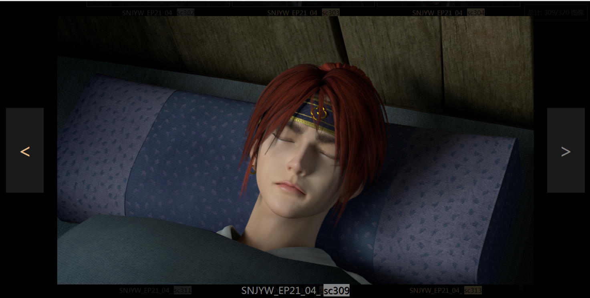

.. _创建色板:

创建色板
===============

为一个文件夹中的图像文件(.jpg, .png, .jpeg)创建html色板

启动
------------

将wlf包加入你python的site-packages之后

使用 ``python -m wlf.csheet -h`` 查看命令行参数

如果不带任何参数调用将会显示图形界面

设置并生成
-----------------

.. note::

  GUI界面仅支持CGTeamWork的计算机, 本地生成请直接使用命令行界面

=========================== =========================================================================================
设置                         功能
=========================== =========================================================================================
:guilabel:`项目`              包含了当前所有CGTeamWork项目, 在此选择你想操作的项目
:guilabel:`前缀匹配`          使用此项进行过滤, 镜头名称不以此项内容开始的镜头将会被排除
生成 :guilabel:`动图`         如果勾选此项, 将会在服务器上利用提交的视频生成动图, 已经被其他人生成过的视频将会自动跳过
:guilabel:`输出路径`          色板会输出至此路径下
:guilabel:`打包至本地`        如果勾选此项, 将会对色板进行 :ref:`打包`
=========================== =========================================================================================

设置完成后点击 :guilabel:`OK` 进行生成

生成后完成会自动在你的默认浏览器中打开页面

.. _`打包`:

打包
**********

.. note::

  打包后, 色板将会被"冻结": 即便服务器上的文件更新了色板也不会更新。

默认生成的色板文件需要能够连接得上CGTeamWork服务器并能够访问本包的目录才能正常查看

如果需要脱离服务器, 需要在设置中勾选 :guilabel:`打包到本地`

勾选后, 将会在生成过程中自动下载所有所需资源至 :guilabel:`输出文件夹`

.. figure:: not_packed.png

  未打包的色板

  打包过的色板

使用
--------------

.. note::

  需要支持ES6的主流浏览器, 如果使用的是低版本IE会提示更新浏览器。

  色板页面(使用Chrome打开)

大图查看
****************

  点击任意缩略图进入大图查看器

此功能在禁用脚本时也能基本使用

使用 `<` 和 `>` 按钮切换上一张下一张

点击空白处回到缩略图视野

动图
********************

鼠标悬停在缩略图上时如果有动图将会切换成动图显示

如果这一镜头只有视频将固定为动图显示

.. tip::

  安装了吾立方Nuke插件后可直接将此处大图拖入Nuke。

刷新
*************

每当缩略图滚入视野会自动刷新

鼠标划过缩略图也会更新

更新最低间隔10秒, 以减少卡顿

