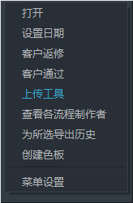
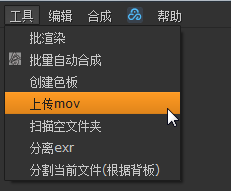
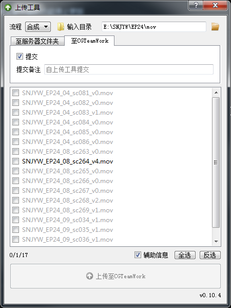
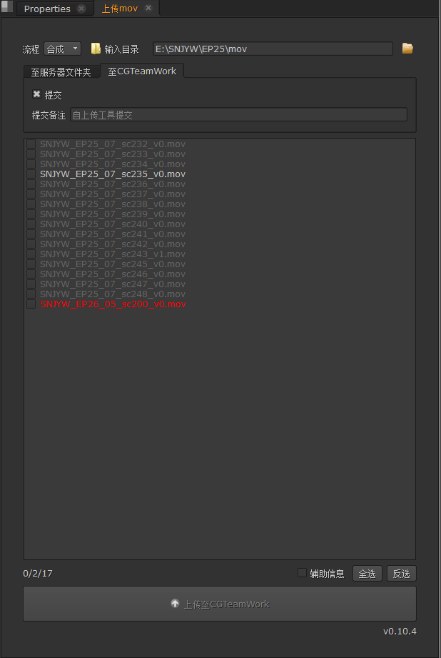
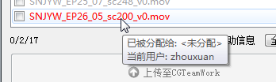

上传工具
===============

上传工作成果至服务器或CGTeamWork

.. tip::

  现在全面使用CGTeamWork, 上传至服务器的功能停止更新

启动
------------

在Nuke和CGTeamWork中都已添加对应菜单

  CGTeamWork菜单

  Nuke菜单

如果要独立启动

在python中使用以下语句

.. code-block:: python

  import wlf.uploader
  wlf.uploader.main()

使用
----------------

  独立运行的上传工具

  在Nuke中运行的上传工具

============================= ==============================================================================================
设置                           功能
============================= ==============================================================================================
:guilabel:`流程`                选择要上传的内容对应的流程, 根据流程不同会对文件夹中的文件类型进行过滤, 详见下表
:guilabel:`输入目录`            将会监视此目录, 发现新文件或目录变更时将自动更新数据库信息; 点击此标签可在资源管理器中打开输入目录
:guilabel:`提交`                如果取消勾选, 将不会在CGTeamWork上生成提交记录, 不建议这样做
:guilabel:`提交备注`            CGTeamWork提交记录的备注信息, 用于记录此次提交的内容, 如果不填将使用默认信息
:guilabel:`辅助信息`            如果勾选, 将启用 :ref:`辅助功能`
:guilabel:`全选`                点击以勾选文件框中所有可上传文件
:guilabel:`反选`                点击以反选文件框中所有可上传文件
:guilabel:`上传至CGTeamWork`    点击以上传文件框中所有可上传文件至CGTeamWork
============================= ==============================================================================================

|

======== ==============================
流程      文件类型
======== ==============================
灯光      ``.jpg``,  ``.jpeg``
渲染      ``.mov``
合成      ``.mov``
======== ==============================

设置并勾选需上传内容后点击 :guilabel:`上传至CGTeamWork` 进行上传

版本过滤
----------------------

如果文件以 `*_v版本` 方式命名

文件框中将只会显示文件的最新版本

文件比较
-------------

如果文件和服务器上的文件相同

文件名称将显示为灰色, 无需也无法上传

.. _`辅助功能`:

辅助功能
--------------------

双击文件框中的文件将直接打开对应文件

如果文件同目录有 `burn-in` 文件夹并且勾选了 :guilabel:`辅助信息`

将打开 `burn-in` 文件夹中的对应文件

文件检查
-------------------

如果不是分配给当前用户的任务或者有其他问题,

条目将会显示为红色, 鼠标悬停可查看具体错误信息。
